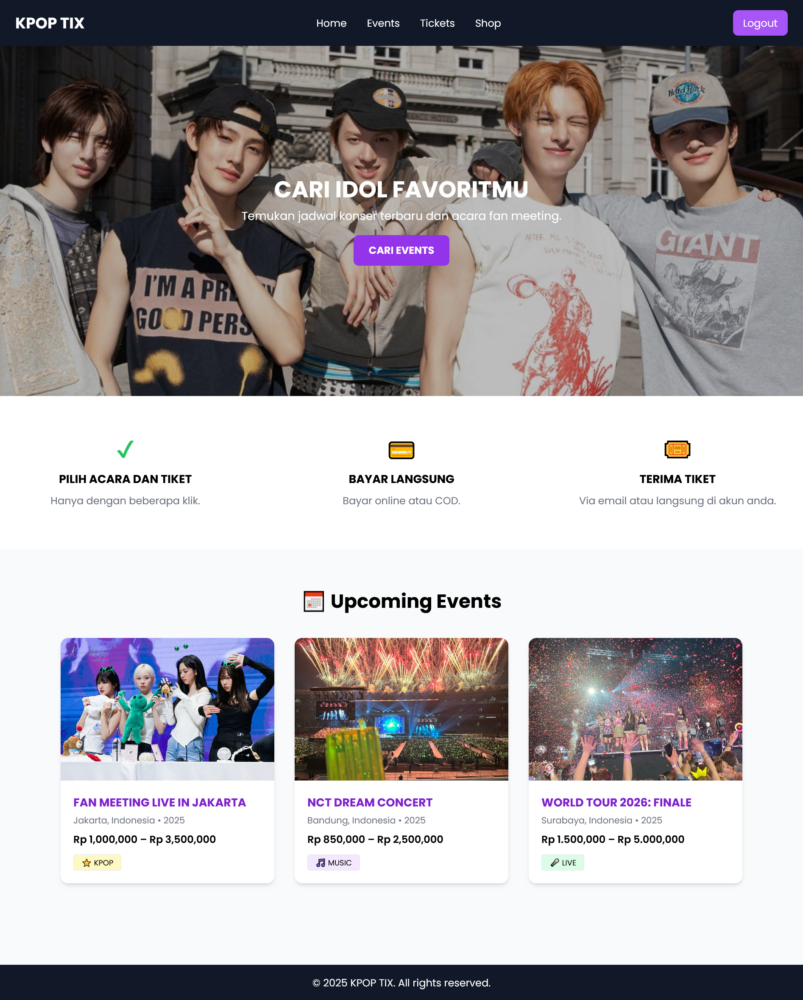
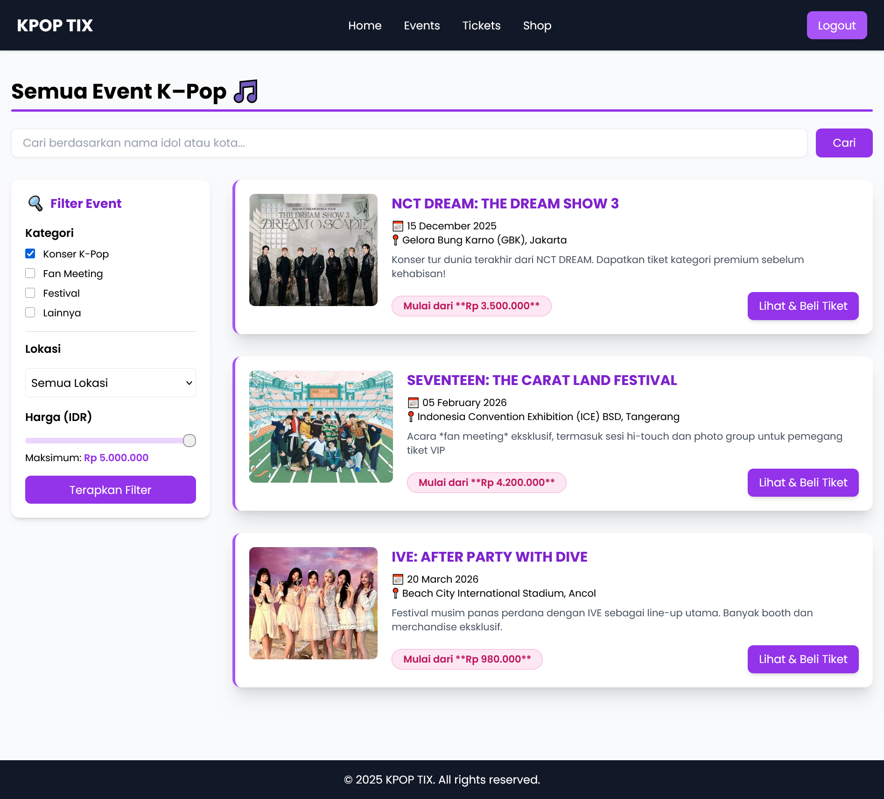
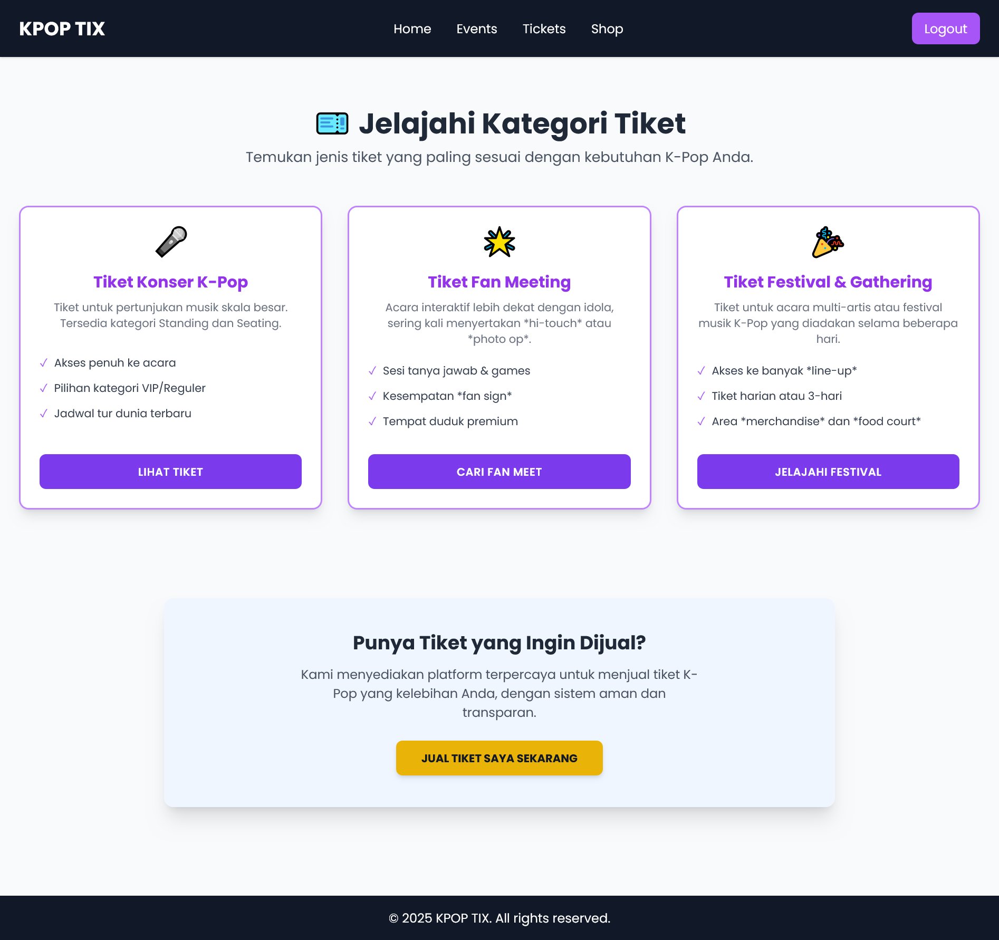
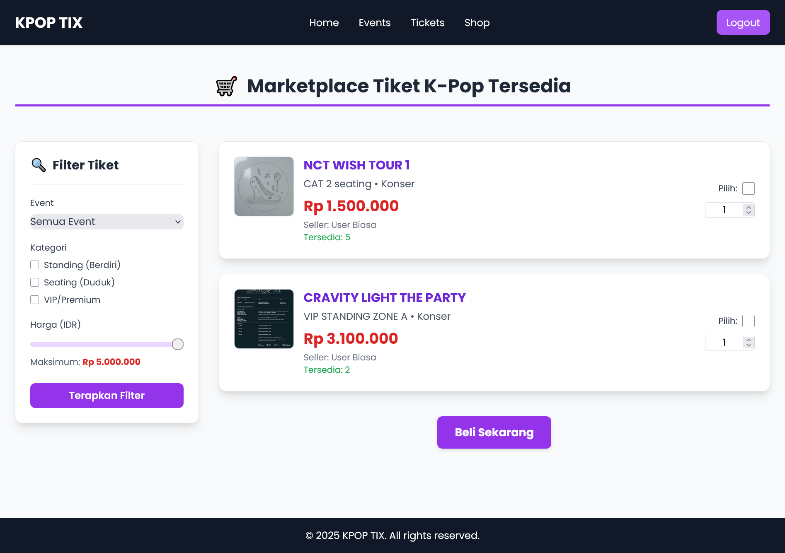

# UAS Pemrograman berbasis Web
## Sistem Penjualan Tiket Konser

## 👥 Anggota Kelompok
- Raihan Nurul Islami ( membuat bagian user)
- Jihan Ammara Shakila (membuat bagian admin)

## 📌 Deskripsi Proyek
Aplikasi Penjualan Tiket Konser berbasis web menggunakan framework Laravel.
Aplikasi ini memungkinkan pengguna untuk melihat daftar event konser,
memilih tiket, melakukan pembelian, dan mendapatkan konfirmasi transaksi, dan juga pengguna bisa menjual kembali tiket mereka di form penjualan tiket, nanti tiket yg mereka jual akan masuk ke shop, juga di shop dan event filter di sidebarnya juga jalan supaya pengguna bisa filterkan harga tiketnya di event dan shop.

Tampilan antarmuka aplikasi dibangun menggunakan Tailwind CSS
untuk menghasilkan desain yang responsif dan konsisten.

## ✨ Fitur Utama
- Halaman Home
- Daftar Event Konser
- Detail Tiket
- Pembelian Tiket
- Konfirmasi Pembelian
- form pengajuan penjualan tiket oleh pengguna

## 🛠️ Teknologi
- Laravel
- PHP
- Blade Template
- HTML
- Tailwind CSS
- JavaScript
- MySQL

### 📸 Screenshot Fitur

#### Halaman Home

#### Daftar Event

#### Halaman Tiket

#### Halaman Shop

#### Konfirmasi Pesanan

#### Form Jual Tiket

#### Berhasil Kirim Form

#### Dashboard Admin

## ▶️ Cara Menjalankan
1. Clone repository
2. Jalankan `composer install`
3. Copy `.env.example` ke `.env`
4. Atur database
5. Jalankan `php artisan migrate`
6. Jalankan `php artisan serve`
